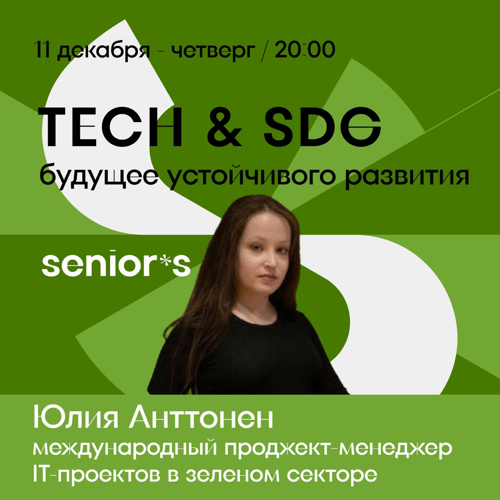

<div align="center">

# 🍸 Senior's Bar

### `where tech meets drinks`

<a href="https://t.me/theseniorsbar"></a>

---

**IT-бар с душой и докладами каждый день**

</div>

## 👋 О нас

**Senior's** — это не просто бар. Это место, где разработчики, дизайнеры, продакты и просто любопытные люди собираются, чтобы обсудить технологии, послушать доклады и выпить отличные коктейли.

Каждый вечер у нас происходит что-то интересное: митапы, воркшопы, дискуссии о Web3, AI, стартапах и карьере в IT. Мы верим, что лучшие идеи рождаются за барной стойкой, а не в переговорках.

> *"Код пишется лучше после первого негрони"* — народная мудрость Senior's

```python
class SeniorsBar:
    def __init__(self):
        self.vibe = "cozy_tech"
        self.drinks = "exceptional"
        self.talks = "every_damn_day"
    
    def visit(self):
        return "best_decision_ever"
```

---

## 🍹 Меню

**[→ Полное меню напитков (DRINKS.md)](DRINKS.md)**

---

## 📅 Дайджест мероприятий

### Неделя 9–14 декабря

> Шесть дней — шесть поводов выпить классные коктейли и узнать много интересного в Senior's 💛

| День | Мероприятие | Время |
|------|-------------|-------|
| **Вт, 9 дек** | 🎮 [GameFi: как устроены Web3-игры](https://t.me/theseniorsbar/214) | 20:00 |
| **Ср, 10 дек** | 💼 [Опционы, доли или деньги?](https://t.me/theseniorsbar/215) | 20:00 |
| **Чт, 11 дек** | 🌍 [Tech & SDG: будущее устойчивого развития](https://t.me/theseniorsbar/213) | 20:00 |
| **Пт, 12 дек** | 🍻 Сеньорские негрони + караоке | 16:00 |
| **Сб, 13 дек** | 🎤 Караоке | 16:00 |
| **Вс, 14 дек** | ☀️ [Завтрак "Эволюция кода"](https://t.me/tcalendar_bot/app?startapp=eyJtb2RlIjoidmlldyIsInRva2VuIjoiNzZmYWVmMzNkNzFkODkxNTY0M2QyOGJjNGM0OCJ9) / 😤 [Айти-нытьё](https://t.me/theseniorsbar/212) | 11:00 / 19:00 |

---

### 🎮 Вторник, 9 декабря — GameFi: как устроены Web3-игры


В 20:00 разбираем, что стоит за web3-играми: модели (play-to-earn, play-and-own, on-chain), экономика токенов, зачем нужен блокчейн и как отличить перспективный проект от хайповой пустышки.

**[→ Подробнее](https://t.me/theseniorsbar/214)**

---

### 💼 Среда, 10 декабря — Опционы, доли или деньги?


Что на самом деле стоит за обещанием "дадим опционы". Поговорим о вестинге, ликвидности и реальной ценности мотивационных пакетов в IT и стартапах.

🎤 **Спикер:** Майкл Князев — создатель Senior's Bar, инженер и IT-предприниматель, экс-CTO стартапов, 17+ лет в разработке.

**[→ Подробнее](https://t.me/theseniorsbar/215)**

---

### 🌍 Четверг, 11 декабря — Tech & SDG: будущее устойчивого развития



Как IT влияет на 17 целей ООН — обсудим зеленые тренды, климат-проекты, Web3-инициативы, риски ИИ-токенов и солнечных панелей.

**[→ Подробнее](https://t.me/theseniorsbar/213)**

---

### 🍻 Пятница, 12 декабря — Сеньорские негрони

Пятница создана, чтобы не спешить домой. Негрони, караоке, отличная компания — короче, отдыхаем максимально! Начинаем в 16:00.

---

### 🎤 Суббота, 13 декабря — Караоке

Наш традиционный субботний марафон песен и смелости. Приходи спеть любимые хиты! Начинаем в 16:00.

---

### 😴 Воскресенье, 14 декабря


**11:00** — [Завтрак сообщества "Эволюция кода"](https://t.me/tcalendar_bot/app?startapp=eyJtb2RlIjoidmlldyIsInRva2VuIjoiNzZmYWVmMzNkNzFkODkxNTY0M2QyOGJjNGM0OCJ9): обсуждаем будущее разработки

**19:00** — [Айти-нытьё](https://t.me/theseniorsbar/212): можно пожаловаться, поделиться новостями или просто посидеть среди своих *(обратите внимание, начинаем на час раньше, чтобы выспаться к утру понедельника)*

---

<div align="center">

## 📍 Найди нас

<a href="https://t.me/theseniorsbar"></a>&nbsp;&nbsp;&nbsp;
<a href="https://www.instagram.com/theseniorsbar/"></a>&nbsp;&nbsp;&nbsp;
<a href="https://x.com/theseniorsbar"></a>&nbsp;&nbsp;&nbsp;
<a href="https://www.threads.com/@theseniorsbar"></a>&nbsp;&nbsp;&nbsp;
<a href="https://www.linkedin.com/company/theseniorsbar/"></a>

---

**Made with 🍸 by Senior's community**

</div>

