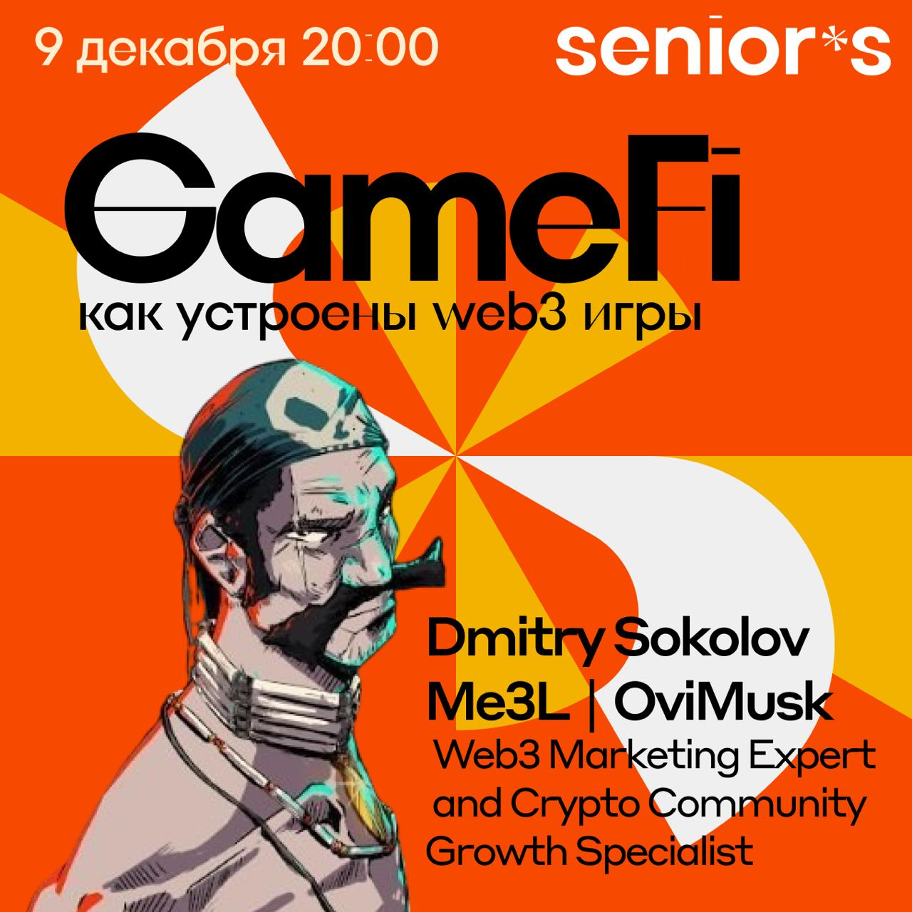
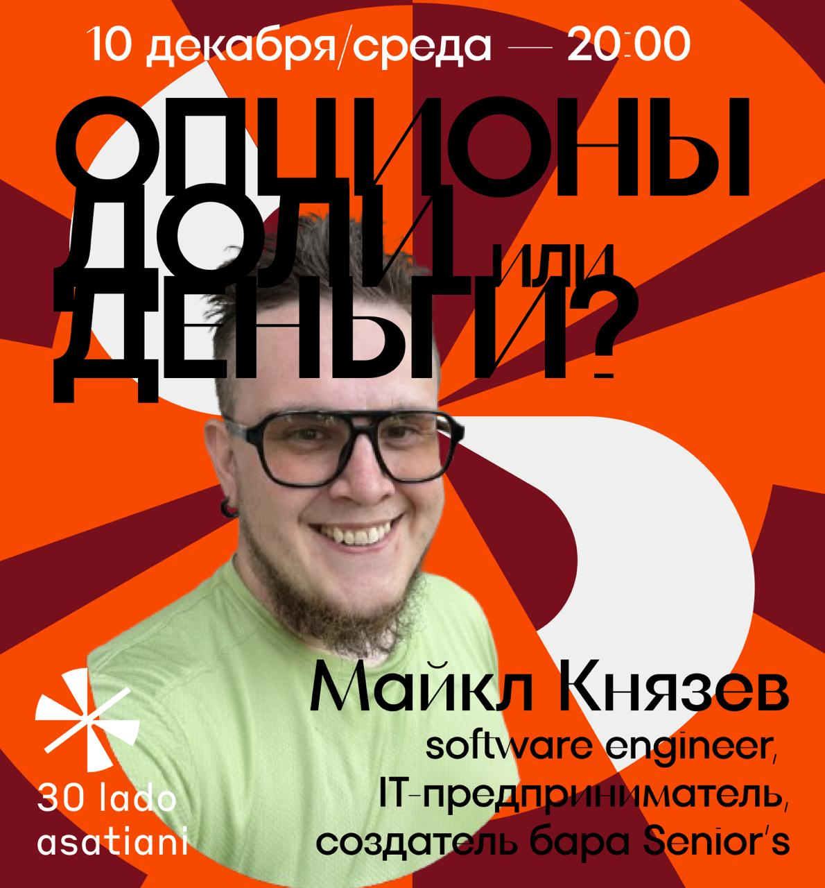

# 🍸 Senior's Bar

### `where tech meets drinks`

---

**IT bar with soul and talks every day**

## 👋 About Us

**Senior's** is not just a bar. It's a place where developers, designers, product managers, and curious minds gather to discuss technology, listen to talks, and enjoy great cocktails.

Every evening something interesting happens here: meetups, workshops, discussions about Web3, AI, startups, and IT careers. We believe the best ideas are born at the bar counter, not in meeting rooms.

> *"Code flows better after the first negroni"* — Senior's folk wisdom

## 🍹 Menu

**[Drinks](DRINKS.md)**

## 📅 Events Digest

### Week of December 9–14

> Six days — six reasons to enjoy great cocktails and learn something interesting at Senior's 💛

| Day | Event | Time |
|-----|-------|------|
| **Tue, Dec 9** | 🎮 [GameFi: How Web3 Games Work](https://t.me/theseniorsbar/214) | 20:00 |
| **Wed, Dec 10** | 💼 [Options, Equity, or Cash?](https://t.me/theseniorsbar/215) | 20:00 |
| **Thu, Dec 11** | 🌍 [Tech & SDG: The Future of Sustainable Development](https://t.me/theseniorsbar/213) | 20:00 |
| **Fri, Dec 12** | 🍻 Senior's Negroni Night + Karaoke | 16:00 |
| **Sat, Dec 13** | 🎤 Karaoke | 16:00 |
| **Sun, Dec 14** | ☀️ [Breakfast "Code Evolution"](https://t.me/tcalendar_bot/app?startapp=eyJtb2RlIjoidmlldyIsInRva2VuIjoiNzZmYWVmMzNkNzFkODkxNTY0M2QyOGJjNGM0OCJ9) / 😤 [IT Whining](https://t.me/theseniorsbar/212) | 11:00 / 19:00 |

---

### 🎮 Tuesday, December 9 — GameFi: How Web3 Games Work

At 20:00 we'll explore what's behind web3 games: models (play-to-earn, play-and-own, on-chain), token economics, why blockchain matters, and how to tell a promising project from a hyped shell.

**[→ Learn More](https://t.me/theseniorsbar/214)**

---

### 💼 Wednesday, December 10 — Options, Equity, or Cash?

What's really behind the promise of "we'll give you options." We'll discuss vesting, liquidity, and the real value of incentive packages in IT and startups.

🎤 **Speaker:** Michael Knyazev — founder of Senior's Bar, engineer and IT entrepreneur, ex-CTO of startups, 17+ years in development.

**[→ Learn More](https://t.me/theseniorsbar/215)**

---

### 🌍 Thursday, December 11 — Tech & SDG: The Future of Sustainable Development

How IT impacts the UN's 17 goals — we'll discuss green trends, climate projects, Web3 initiatives, AI token risks, and solar panels.

**[→ Learn More](https://t.me/theseniorsbar/213)**

---

### 🍻 Friday, December 12 — Senior's Negroni Night

Friday was made for not rushing home. Negroni, karaoke, great company — basically, maximum relaxation! Starting at 16:00.

---

### 🎤 Saturday, December 13 — Karaoke

Our traditional Saturday marathon of songs and courage. Come sing your favorite hits! Starting at 16:00.

---

### 😴 Sunday, December 14

**11:00** — [Community Breakfast "Code Evolution"](https://t.me/tcalendar_bot/app?startapp=eyJtb2RlIjoidmlldyIsInRva2VuIjoiNzZmYWVmMzNkNzFkODkxNTY0M2QyOGJjNGM0OCJ9): discussing the future of development

**19:00** — [IT Whining](https://t.me/theseniorsbar/212): feel free to complain, share news, or just hang out with your people *(note: starting an hour earlier so you can get enough sleep before Monday)*

---

## 📍 Find Us

&nbsp;&nbsp;&nbsp;
&nbsp;&nbsp;&nbsp;
&nbsp;&nbsp;&nbsp;
&nbsp;&nbsp;&nbsp;

---

**Made with 🍸 by Senior's community**

